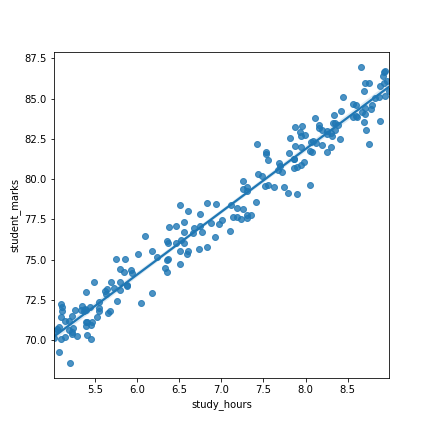

# Student-Marks-Predictor-on-the-basis-of-study-hours
# Project OverView
* This model is built with an aim to predict the percentage of the students that they get according to the time they spend on their studt.
* Filled the missing data with the mean.
* Used simple linear regression which gave me the perfect result so that I did not seek for other models.
* Reached around 94% of accuracy for our predition.
* Model is brought into production using Streamlit framework.https://www.streamlit.io/

# Code and Resources Used
Python version : 3.8.3
Packages: pandas, numpy, matplotlib,  scikitlearn, pickle, streamlit
For Web Framework Requirements : pip install sreamlit
# Problem Definition
Here the business domain problem is that we are given simple student dataset and from that we have to predict the marks of students.

> Given a dataset of students, how well our model can predict the marks of the students?
# Tools
  * Numpy - for numerical operations
  * Pandas - for data analysis
  * Matplotlib - for data visualization
  * Scikit-Learn(Sklearn) - for machine learning modelling
  
# EDA
> Here we can see some missing data though image name is empty don't get confuse with that

> Linear regression graph between students study hours and marks

# Model Building
I filled the missing data with the mean of study hours
Like usual,I also split the data in the ratio of 8:2 i.e. 80% of the data was used for train set and 20% data was used for test set.
I used Linear Regression and did not seeked to used other model as it gave me the perfect score since the dataset is very small.
NOTE: If my data set was very big, for example as in my Nepal_COVID-19_New_Cases project, we must try different models to compare the accuracy.

# Productionization

I used spyder IDE using streamlit framework to build frontend website to enter the study hours to predict the marks of students get in their examination.

